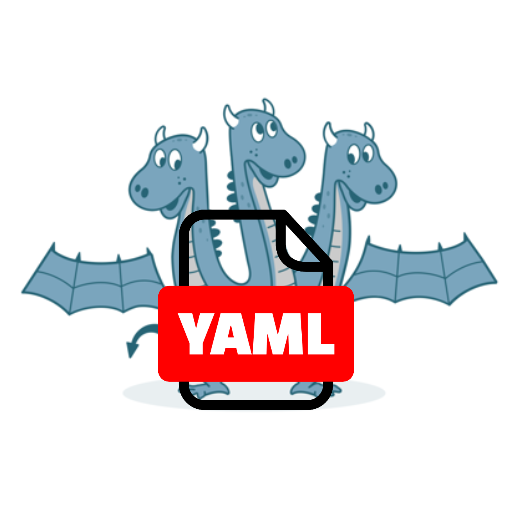

# 🐉 Python Hydra YAML

[](LICENSE)
[](https://www.python.org/downloads/)
[](https://google.github.io/styleguide/pyguide.html#s3.8-comments-and-docstrings)

**Python Hydra YAML** is a powerful VSCode extension providing intelligent autocompletion, validation, and semantic highlighting for [Hydra](https://hydra.cc) YAML configuration files.

## ✨ Features

- 💡 Intelligent code completion for Hydra special keys (`_target_`, `_args_`, etc.)
- 🔍 Python import path completion for `_target_` and path values
- 🧩 Argument completion for callable targets based on their signatures
- 🎨 Semantic token highlighting for special keys, target values, and interpolations
- ⚠️ YAML syntax validation and diagnostics
- 🔄 Support for Hydra interpolations (`${...}` syntax)
- 🔌 Seamless integration with VS Code

## 📦 Installation

### VS Code Extension

Install from the [VS Code Marketplace](https://marketplace.visualstudio.com/items?itemName=GesonAnko.python-hydra-yaml):

1. Open VS Code
2. Go to Extensions view (`Ctrl+Shift+X` or `⌘⇧X`)
3. Search for "Python Hydra YAML"
4. Click Install

## 🧰 Requirements

- Python 3.12+
- VS Code 1.99.0+
- Python VS Code Extension

## 📝 Usage

### Configuring the Extension

1. Install the extension from the VS Code marketplace
2. Open a project with Hydra YAML configuration files
3. Set the Hydra configuration directory:
   - Use `Ctrl+Shift+P` or `⌘⇧P` to open the Command Palette
   - Search for "Select Hydra Configuration Directory" and choose your configs folder
   - Or set it manually in VS Code settings: `pythonHydraYaml.configDir`

## 📄 License

This project is licensed under the MIT License - see the [LICENSE](LICENSE) file for details.

## 🤝 Contributing

### Server Development Setup

First, install [**uv**](https://docs.astral.sh/uv/getting-started/installation/)

```bash
# Clone the repository
git clone https://github.com/Geson-anko/python-hydra-yaml.git
cd python-hydra-yaml/hydra-yaml-lsp

# Set up virtual environment with all dependencies
make venv

# Run all tests
make test

# Run all checks (tests and type checking)
make run
```

### Extension Development Setup

First, please install [**node**](https://nodejs.org/en/download/) and **yarn** (`npm install -g yarn`)

```bash
cd python-hydra-yaml/python-hydra-yaml

# Install dependencies
yarn install

# Format files
yarn format
```

Press `F5` and open `sample-python-project` for testing.

### Contribution Flow

Contributions are welcome! Please feel free to submit a Pull Request.

1. Fork the repository
2. Create your feature branch (`git checkout -b feature/amazing-feature`)
3. Run all workflow (`make run` for server, `yarn test` for extension)
4. Commit your changes (`git commit -m 'Add some amazing feature'`)
5. Push to the branch (`git push origin feature/amazing-feature`)
6. Open a Pull Request
