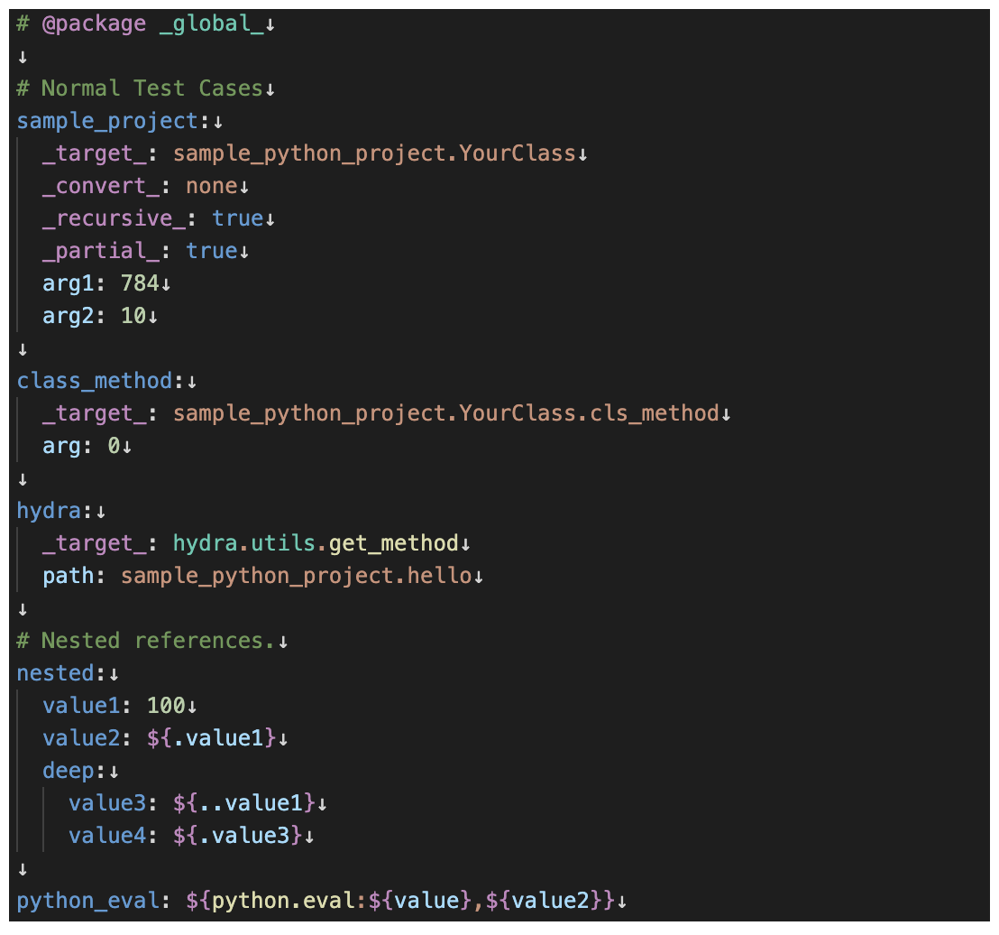

# 🐉 Hydra YAML VSCode Client

VSCode extension providing intelligent autocompletion and validation for Hydra configuration files.

## ✨ Features

- 🔍 Python import path completion for `_target_` fields
- 💡 Smart completion for Hydra special keywords (`_partial_`, `_args_`, `_recursive_`, `_convert_`)
- 🧩 Argument completion based on target Python classes
- 🎨 Semantic highlighting for Hydra special elements



## 🚀 Development Setup

```bash
# Install dependencies
yarn install

# Compile the extension
yarn compile

# Watch for changes during development
yarn watch
```

## 🐛 Debugging

1. Open the project in VSCode
2. Press F5 to start debugging
3. In the Extension Development Host window, open a folder containing Hydra YAML files
4. Select the Python interpreter and configure the Hydra configuration directory when prompted

## 📁 Project Structure

- `src/extension.ts` - Main extension entry point
- `src/test` - Extension tests

## 📦 Building and Packaging

```bash
# Run linting
yarn lint

# Run tests
yarn test

# Package the extension
yarn package
```

## 📋 Requirements

- Node.js and yarn
- Python 3.12+ with Hydra installed
- VSCode 1.99.0+

## 📄 License

MIT
